# 功能文档

本文档记录系统所有已实现功能模块的入口与操作路径，用于测试验收与后续开发参考。

---

## 目录

1. [注册与登录](#1-注册与登录)
2. [广场·招募帖列表与筛选](#2-广场招募帖列表与筛选)
3. [发帖](#3-发帖)
4. [帖子详情与申请加入](#4-帖子详情与申请加入)
5. [人才库](#5-人才库)
6. [他人档案页](#6-他人档案页)
7. [个人中心（三个 Tab）](#7-个人中心三个-tab)
8. [队伍主页](#8-队伍主页)
9. [申请审批（队长视角）](#9-申请审批队长视角)
10. [消息与系统通知](#10-消息与系统通知)
11. [全局导航](#11-全局导航)

---

## 1. 注册与登录

### 1.1 注册

| 项目 | 说明 |
|------|------|
| **入口** | 导航栏「登录」→ 点击「注册」tab / 直接访问 `/auth/register` |
| **路径** | `/auth/register` |
| **操作步骤** | 填写邮箱、昵称、密码 → 点击「注册」→ 自动登录并跳转至广场 |
| **关键状态** | 首次注册后会弹出「完善个人档案」引导弹窗 |

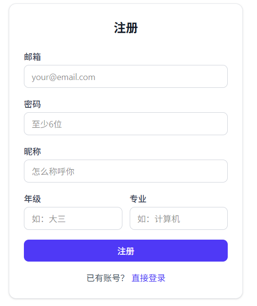

### 1.2 登录

| 项目 | 说明 |
|------|------|
| **入口** | 导航栏「登录」 |
| **路径** | `/auth/login` |
| **操作步骤** | 填写邮箱、密码 → 点击「登录」→ 跳转广场 |
| **错误提示** | 邮箱不存在 / 密码错误 有对应提示 |

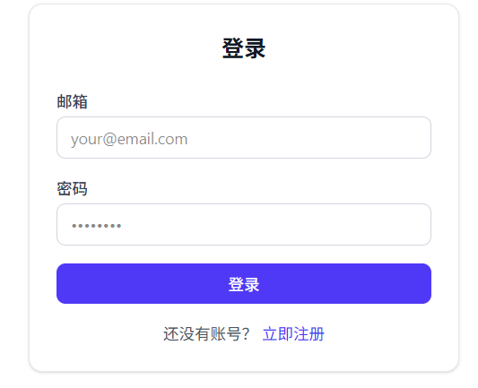

### 1.3 退出登录

| 项目 | 说明 |
|------|------|
| **入口** | 个人中心 → 点击「退出登录」 |
| **操作路径** | `/profile` → 右上角退出登录按钮 → 跳转至广场，导航栏变回「登录」 |

---

## 2. 广场·招募帖列表与筛选

### 2.1 广场首页

| 项目 | 说明 |
|------|------|
| **入口** | 导航栏「广场」/ 直接访问 `/square` |
| **路径** | `/square`（也是系统默认首页 `/` 的自动跳转目标） |

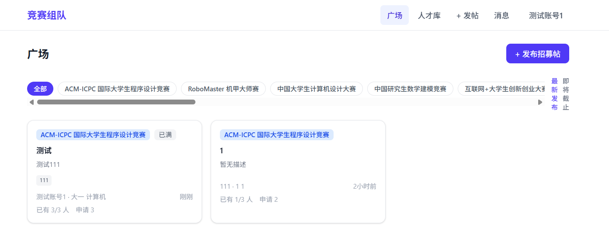

**页面元素**：
- 顶部：竞赛分类横向标签（全部 / 数学建模 / 挑战杯 / …）
- 次级：排序选项（最新发布 / 即将截止）
- 主体：帖子卡片网格（桌面2-3列，移动端单列）
- 右上角：+ 发布招募帖按钮

**操作路径**：
1. 点击分类标签 → 筛选仅显示该竞赛的帖子
2. 点击排序 → 切换排序方式
3. 点击帖子卡片 → 跳转帖子详情页 `/post/{id}`
4. 点击「+ 发布招募帖」→ 跳转发帖页 `/post/new`

**帖子卡片字段**：
竞赛名称徽章 / 帖子标题 / 描述摘要 / 需求技能标签 / 发帖人昵称、年级专业 / 发布时间 / 已有X人/目标Y人 / 申请数

### 2.2 首次登录弹窗

当用户首次注册后进入广场，会弹出「完善个人档案」引导弹窗：

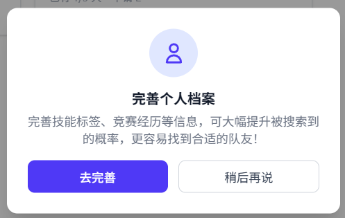

| 操作 | 结果 |
|------|------|
| 点击「去完善」 | 跳转至 `/profile` 编辑资料 |
| 点击「稍后再说」 | 关闭弹窗，下次登录不再弹出 |

---

## 3. 发帖

### 3.1 发布招募帖

| 项目 | 说明 |
|------|------|
| **入口** | 广场右上角「+ 发布招募帖」/ 导航栏「+ 发帖」 |
| **路径** | `/post/new` |
| **操作步骤** | 见下方表单说明 |

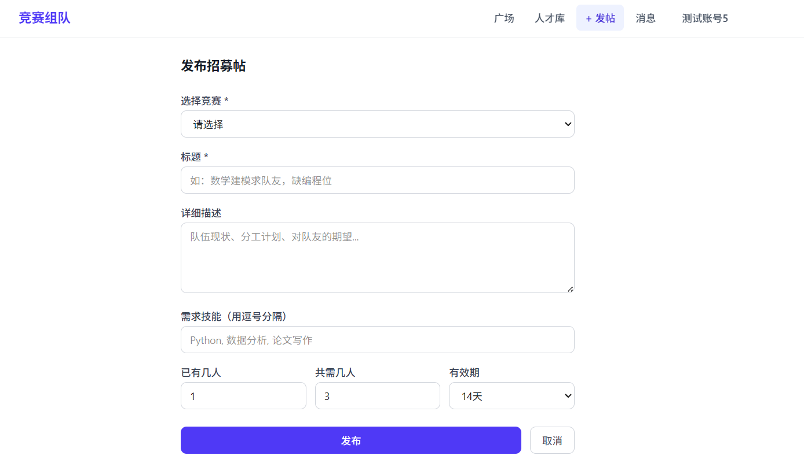

**表单字段**：
| 字段 | 类型 | 说明 |
|------|------|------|
| 选择竞赛 | 搜索选择下拉框 | 从内置竞赛库选择 |
| 帖子标题 | 文本输入 | 必填 |
| 详细描述 | 文本域（可选） | 队伍现状、分工计划等 |
| 需求技能 | 文本输入（逗号分隔） | 如：Python, MATLAB, 论文写作 |
| 已有 X 人 | 数字 | 默认为 1（发布者自己） |
| 共需 X 人 | 数字 | 目标总人数 |
| 有效期 | 选择 7/14/30 天 | 默认 14 天 |

**提交后**：
- 帖子进入广场列表
- 自动生成**初始队伍主页**，队长为发帖人

---

## 4. 帖子详情与申请加入

### 4.1 帖子详情页

| 项目 | 说明 |
|------|------|
| **入口** | 广场点击帖子卡片 |
| **路径** | `/post/{id}` |

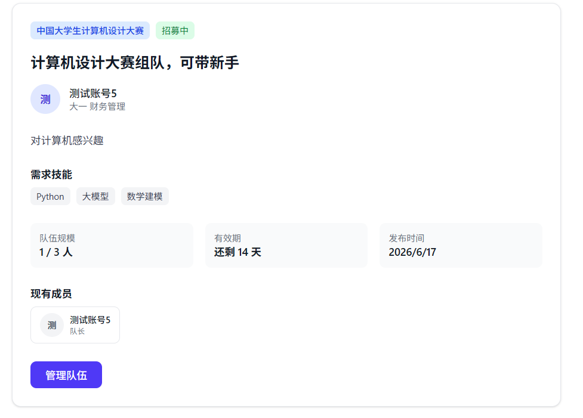

**页面元素**：
- 竞赛名称徽章 + 状态标签（招募中/已满）
- 帖子标题
- 发帖人信息（头像一个昵称→点击跳转其档案）
- 详细描述
- 需求技能标签
- 队伍现有成员列表
- 申请操作区

### 4.2 申请加入

**按钮状态逻辑**（非发帖人视角）：

| 状态 | 按钮显示 | 可点击 |
|------|---------|-------|
| 未申请且招募中 | 「申请加入」 | ✅ |
| 已是队员 | 「已是队员」（灰色） | ❌ |
| 已申请-待回复 | 「已申请，等待回复」（灰色） | ❌ |
| 已申请-已通过 | 「已同意」（灰色） | ❌ |
| 已申请-已拒绝 | 「已拒绝」（灰色） | ❌ |
| 帖子已满 | 「已满」（灰色） | ❌ |

**申请流程**：
1. 点击「申请加入」→ 弹出申请理由输入框
2. 填写理由（50-200字必填）→ 点击「提交申请」
3. 提交后按钮变为「已申请，等待回复」（灰色不可点击）
4. 同时触发**系统通知**给队长

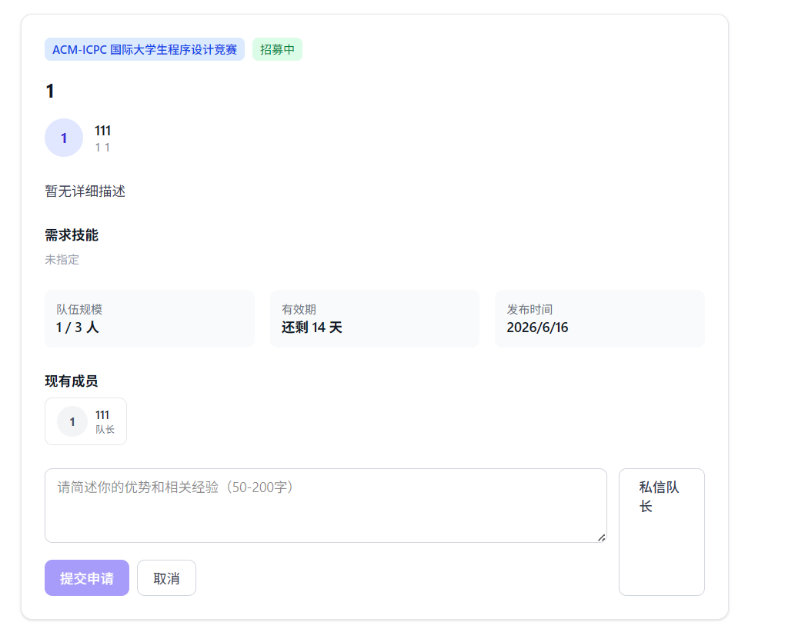

### 4.3 私信队长

在操作区还有一个「私信队长」按钮，点击跳转至 `/messages?to={作者id}`。

---

## 5. 人才库

### 5.1 人才列表页

| 项目 | 说明 |
|------|------|
| **入口** | 导航栏「人才库」 |
| **路径** | `/talent` |

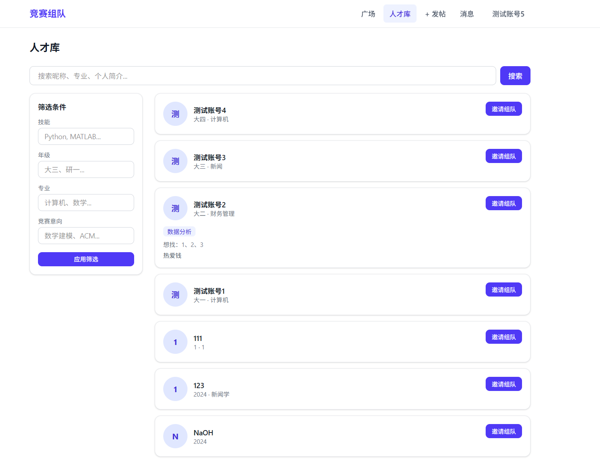

**页面元素**：
- 搜索栏（按昵称/专业/简介搜索）
- 筛选区（桌面端左侧常驻，移动端顶部按钮弹出底部抽屉）
- 人才卡片列表

**筛选条件**：
| 筛选项 | 说明 |
|--------|------|
| 技能 | 多关键词，如：Python, MATLAB |
| 年级 | 如：大三、研一 |
| 专业 | 如：计算机、数学 |
| 竞赛意向 | 如：数学建模、ACM |

**人才卡片字段**：
头像 + 昵称 / 年级·专业 / 技能标签（最多3个） / 竞赛意向 / 个人简介 / 「邀请组队」按钮

**操作路径**：
1. 点击卡片 → 跳转个人档案页 `/profile/{id}`
2. 点击「邀请组队」→ 弹出邀请弹窗 InviteModal

### 5.2 邀请组队弹窗

点击人才卡片上的「邀请组队」按钮弹出：

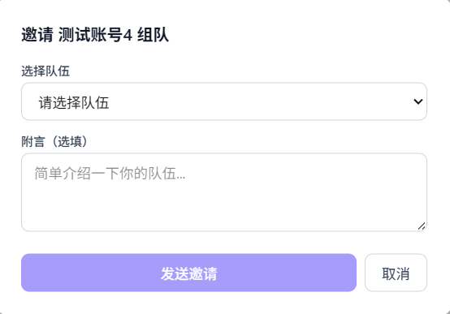

**操作步骤**：
1. 选择队伍（下拉框显示当前用户作为队长的所有队伍）
2. 填写附言（选填）
3. 点击「发送邀请」
4. 被邀请人收到一条类型为 `pending` 的申请记录（applicantId 为被邀请人，captainId 为邀请者）

**边界情况**：
- 用户没有任何队伍时，显示提示「请先发布招募帖」
- 已邀请过 / 已在队伍中 会返回错误提示

---

## 6. 他人档案页

| 项目 | 说明 |
|------|------|
| **入口** | 人才库点击卡片 / 帖子详情点击发帖人头像 / 队伍成员点击头像 |
| **路径** | `/profile/{id}`（注意：带 `id` 参数的是他人档案页） |

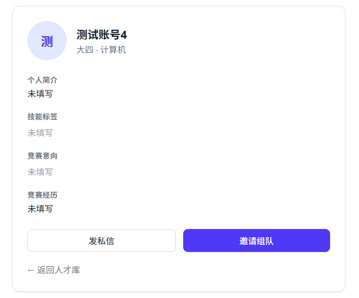

**展示字段**：
头像·昵称 / 年级·专业 / 个人简介 / 技能标签 / 竞赛意向 / 竞赛经历 / 可投入时间

**操作按钮**（他人视角）：
| 按钮 | 操作 |
|------|------|
| 发私信 | 跳转 `/messages?to={id}` |
| 邀请组队 | 弹出 InviteModal 邀请弹窗 |

**特殊状态**：
- 如果查看的是自己的档案（当前用户 ID == 档案 ID），自动跳转至编辑页 `/profile`

---

## 7. 个人中心（三个 Tab）

| 项目 | 说明 |
|------|------|
| **入口** | 导航栏「用户昵称」 |
| **路径** | `/profile` |

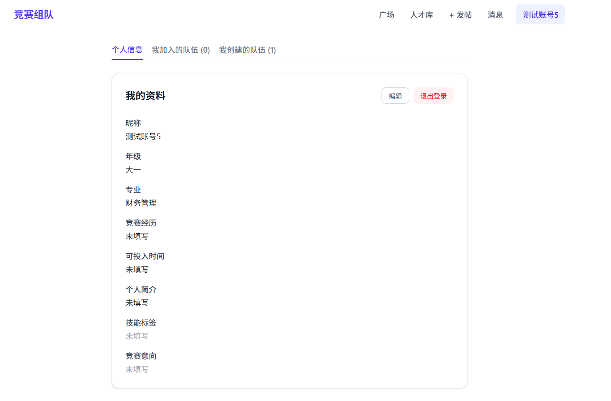

### 7.1 Tab 1: 个人信息

**展示字段**（可编辑）：
昵称 / 年级 / 专业 / 个人简介 / 技能标签 / 竞赛意向 / 竞赛经历 / 可投入时间

**操作**：
| 按钮 | 操作 |
|------|------|
| 编辑 | 切换至编辑模式，字段变为可输入 |
| 保存 | 提交修改到 `/api/users/me` |
| 取消 | 恢复原始数据 |
| 退出登录 | 清除 token，跳转至广场 |

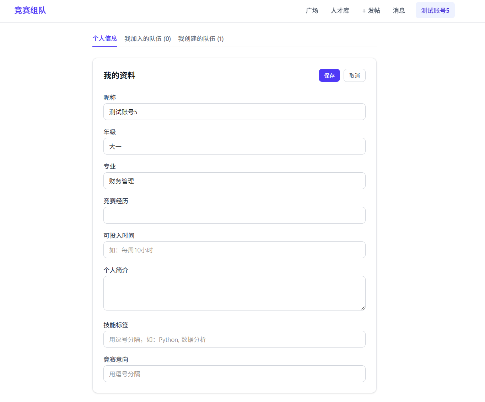

### 7.2 Tab 2: 我加入的队伍

展示两部分内容：

**① 已加入的队伍**（`role === "member"`）
- 队名 / 关联帖子标题 / 成员数 / 队伍状态

**② 待回复的申请**（`status === "pending"` 的申请记录）
- 帖子标题 / 竞赛名称 / 队长昵称 / 状态「待回复」

计数 = 已加入的队伍数 + 待处理的申请数

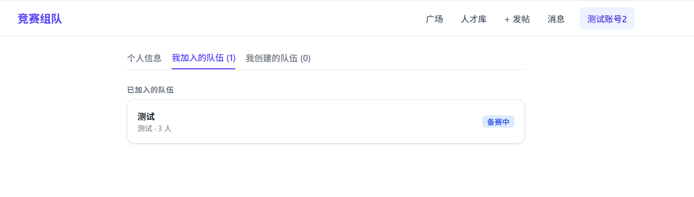

### 7.3 Tab 3: 我创建的队伍

展示当前用户为队长的所有队伍（`role === "captain"`）：
- 队名 / 帖子标题 / 成员数 / 标识「队长」

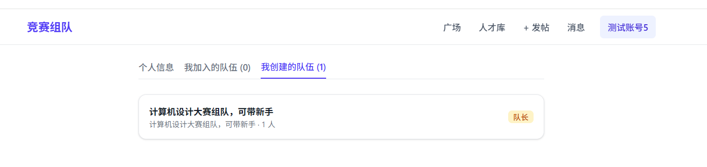

---

## 8. 队伍主页

| 项目 | 说明 |
|------|------|
| **入口** | 个人中心 Tab2 / Tab3 点击队伍 / 帖子详情页 |
| **路径** | `/team/{id}` |

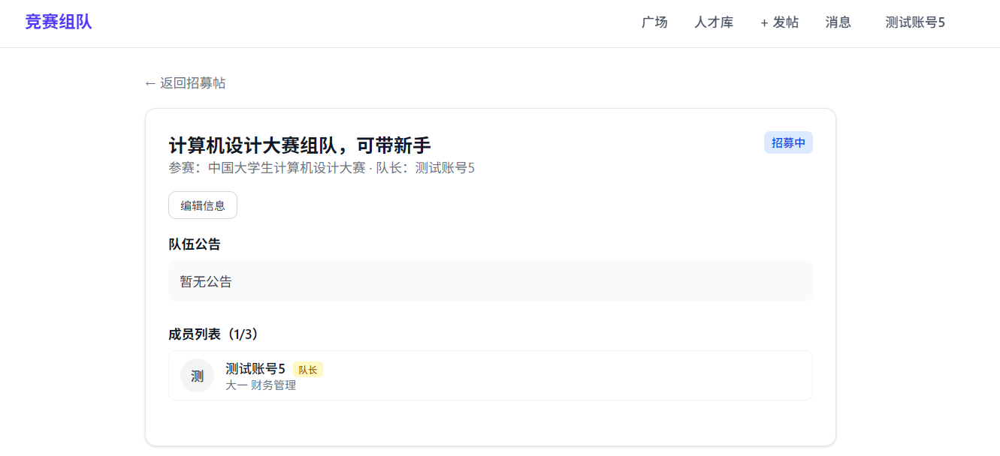

### 8.1 队伍信息区

| 字段 | 编辑权限 |
|------|---------|
| 队伍名称 | 队长可编辑 |
| 参赛竞赛 | 只读 |
| 当前状态（招募中/备赛中/比赛中/已完赛） | 队长可编辑 |
| 当前阶段（如：选题阶段） | 队长可编辑 |

### 8.2 成员列表

每个成员显示：头像一个昵称 / 年级专业 / 角色（队长/队员） / 承担技能

### 8.3 队伍公告

队长可编辑，队员和其他人可查看。

### 8.4 待处理申请

**仅队长可见**。在页面顶部以黄色区块展示当前所有待处理的申请：

每条申请显示：
- 申请人的头像、昵称、年级专业
- 技能标签
- 申请理由
- 「同意」/「拒绝」按钮

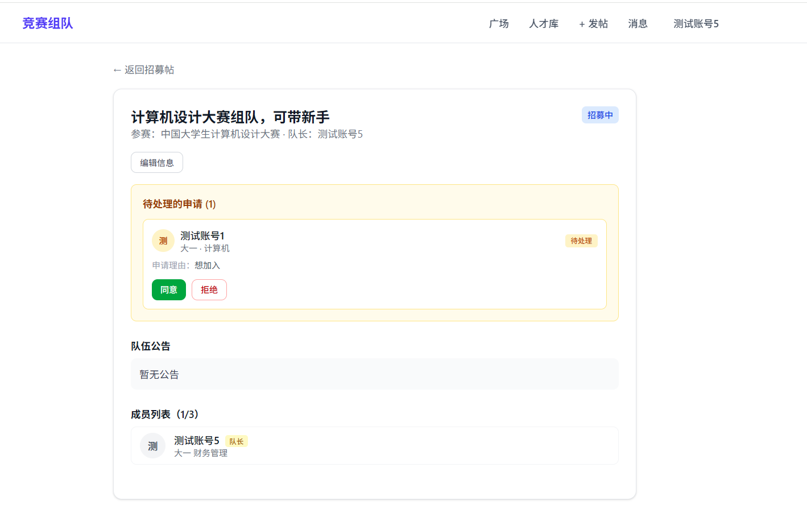

操作后刷新队伍信息（已同意则成员数+1，满员则状态自动变更为"备赛中"）。

### 8.5 历史记录

**仅队长可见**。展示已处理（已同意/已拒绝）的申请记录。

### 8.6 外部协作链接

展示队长配置的外部工具链接（微信群 / 腾讯文档 / GitHub 等），**仅队伍成员可见**。

---

## 9. 申请审批（队长视角）

### 9.1 审批入口

| 入口 | 路径 |
|------|------|
| 队伍主页 → 待处理申请区 | `/team/{id}` |
| 系统通知 → 点击「查看详情」 | 跳转至帖子详情 `/post/{id}` |

### 9.2 审批流程

1. **申请人**在帖子详情提交申请
2. **系统**创建通知给队长（类型 `apply`）
3. **队长**收到通知（消息页「系统消息」列表中）
4. 队长进入队伍主页，在「待处理的申请」区查看完整信息
5. 队长点击「同意」或「拒绝」

### 9.3 同意后的连锁反应

| 操作 | 结果 |
|------|------|
| 申请状态变更为 `accepted` | 申请人在个人中心看到"已通过"状态 |
| 申请人自动加入 TeamMember | 帖子"已有X人" +1 |
| 如满员 | 帖子状态变 `full`，队伍状态变 `preparing` |
| 创建系统通知给申请人 | "你已成功加入队伍「名称」" |

### 9.4 拒绝后的连锁反应

| 操作 | 结果 |
|------|------|
| 申请状态变更为 `rejected` | 申请人在个人中心看到"已拒绝"状态 |
| 创建系统通知给申请人 | "申请已被队长拒绝" |

---

## 10. 消息与系统通知

### 10.1 消息页

| 项目 | 说明 |
|------|------|
| **入口** | 导航栏「消息」 |
| **路径** | `/messages` |
| **支持参数** | `?to={userId}` 直接打开与某用户的对话 |

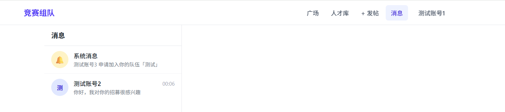

### 10.2 左侧列表

列表有两个部分：

**① 🔔 系统消息**（始终在第一行）
- 显示最新一条通知内容作为预览
- 未读红点显示未读通知数

**② 用户对话列表**
- 按最后消息时间排序
- 显示对方头像（首字）、昵称、最后消息预览、时间
- 未读消息数红点

### 10.3 系统消息面板

点击「系统消息」后右侧展示通知列表：

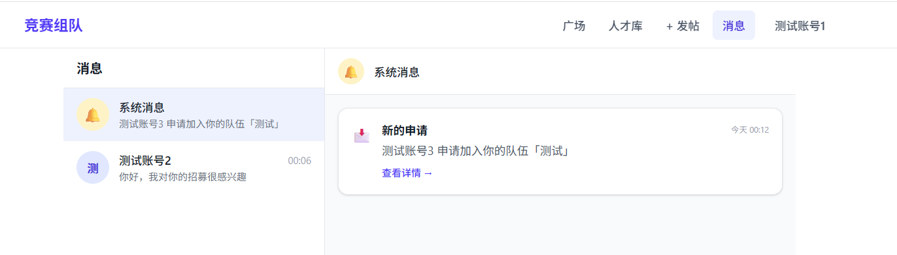

**通知类型**：

| 图标 | 类型 | 触发场景 |
|------|------|---------|
| 📩 | `apply` | 有人申请加入你的队伍 |
| 📢 | `system` | 申请通过/拒绝通知 |
| 💬 | `message` | 预留，暂未使用 |

每条通知显示：图标 / 标题 / 正文 / 时间 / 「查看详情 →」链接

点进系统消息时会自动标记所有通知为已读。

### 10.4 聊天窗口

点击用户对话后右侧展示聊天面板：

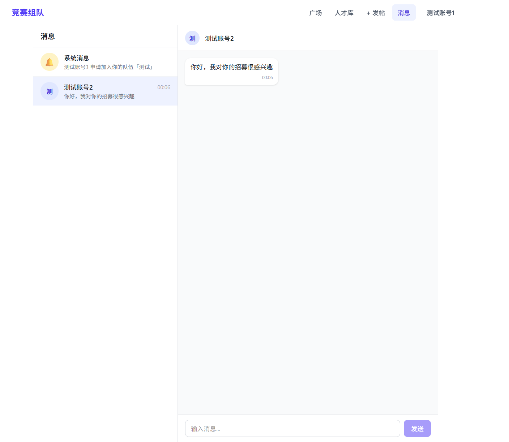

**功能**：
- 消息气泡（本人蓝色/对方白色）
- 快捷短语（初次对话时显示）
- 输入框 + 发送按钮（支持 Enter 发送）
- 轮询每 3s 获取新消息，5s 刷新会话列表
- 自动滚动到底部
- 点击顶部昵称可跳转对方档案页

**图片说明发送逻辑**：
1. 用户在帖子详情或档案页点击「发私信」
2. 跳转至 `/messages?to={userId}`
3. 页面自动打开与该用户的聊天窗口
4. 发送的第一条消息起始该对话

---

## 11. 全局导航

### 11.1 桌面端导航栏

固定在顶部，左侧 Logo「竞赛组队」→ 点击跳转至 `/square`

| 链接 | 路径 | 说明 |
|------|------|------|
| 广场 | `/square` | 默认首页 |
| 人才库 | `/talent` | 搜索人才 |
| + 发帖 | `/post/new` | 发布招募帖 |
| 消息 | `/messages` | 私信与通知 |
| {昵称} | `/profile` | 个人中心（已登录显示） |
| 登录 | `/auth/login` | 未登录时显示 |

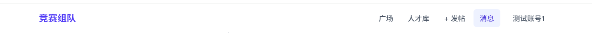

### 11.2 移动端导航

点击汉堡菜单按钮展开下拉列表，内容与桌面端一致。

### 11.3 未登录状态

- 导航栏显示「登录」按钮
- 访问需要登录的页面（如 `/messages`、`/profile`、`/post/new`）会自动跳转至 `/auth/login`

---

## 附：快捷路径速查表

| 功能 | 路径 |
|------|------|
| 广场 | `/square` |
| 发帖 | `/post/new` |
| 帖子详情 | `/post/{id}` |
| 人才库 | `/talent` |
| 他人档案 | `/profile/{id}` |
| 个人中心 | `/profile` |
| 队伍主页 | `/team/{id}` |
| 消息 | `/messages` |
| 消息（指定对话） | `/messages?to={userId}` |
| 登录 | `/auth/login` |
| 注册 | `/auth/register` |

---

*文档生成日期：2026-06-16*
